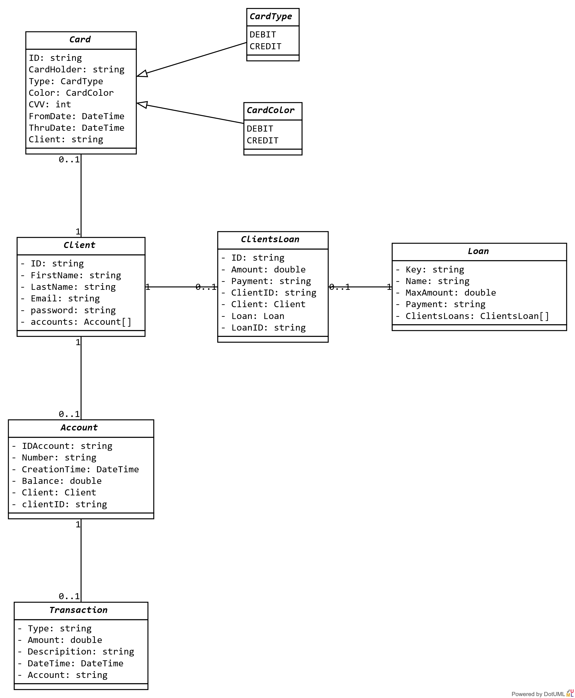

<h1>HomeBankingMindHub repo!</h1>

  <h2>Summary</h2>
  

    This repo contains HomeBankingMindhub's solution. 
  
  

## Iterations
- [x] 1 - Initial configs.
- [x] 2 - Account implementation. 
- [x] 3 - Transactions implementation.
- [x] 4 - Loans implementation.
- [x] 5 - Cards implementation. 
- [x] 6 - Client registration implementation. 
- [x] 7 - create accounts and cards implementation. 
- [x] 8 - Clients transactions implementation.  
- [ ] <b>9 - Client applying loans implementation.(WIP) </b>

  <h2>Class Diagram</h2>
  

